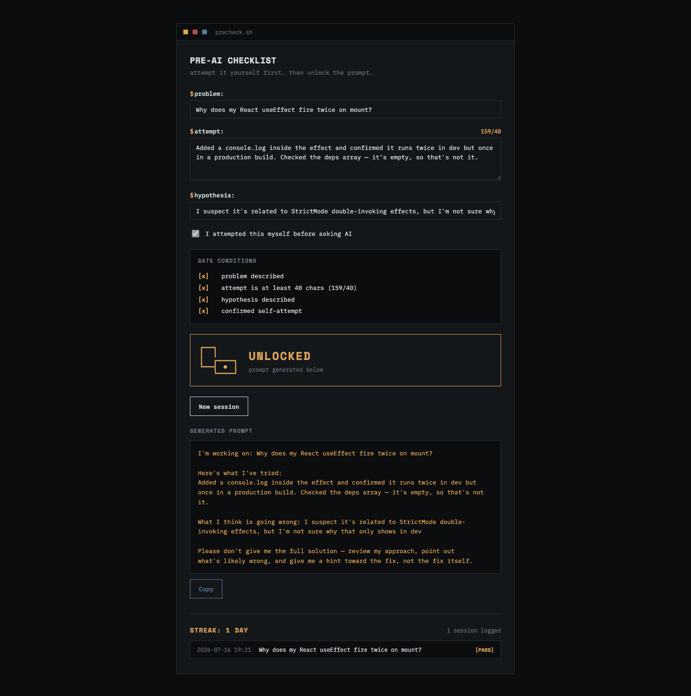
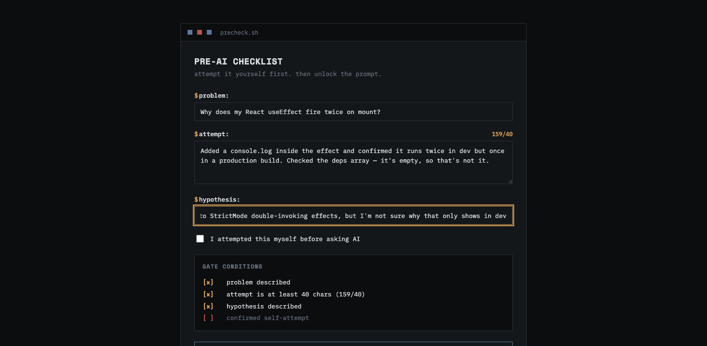
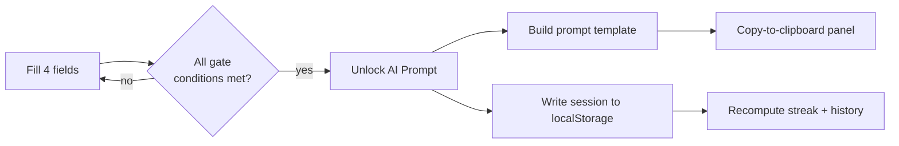

# PreCheck

**A pre-AI checklist gate for coding practice.**

PreCheck is a small local tool that sits between you and an AI assistant. Before you're allowed to ask for help, you have to prove — in writing — that you actually tried the problem yourself. Fill the gate, and it hands you back a clean, well-scoped prompt built from your own attempt. Skip the gate, and there's no prompt to copy.

No backend. No build step. No dependencies to install. One HTML file, running entirely in your browser.




## Key features

- **A four-condition gate** — problem, attempt (40-char minimum), hypothesis, and a self-attestation checkbox, all validated live with a visible `[x]`/`[ ]` checklist.
- **Prompt generation on unlock** — your problem, attempt, and hypothesis are assembled into a ready-to-copy prompt that explicitly asks for a hint, not a solution.
- **One-click copy to clipboard** for pasting straight into whichever AI assistant you use.
- **Persistent session history** — every unlocked session is saved to `localStorage`, with a newest-first log of timestamp, problem, and pass status.
- **Day-streak tracking**, computed locally from your session dates.
- **Zero backend, zero build step** — a single HTML file that runs entirely in the browser.

## Why this exists

It's easy to ask an AI assistant for help the moment something breaks, skip the struggle that actually builds understanding, and walk away having learned nothing about the bug. PreCheck is a deliberate speed bump: a short, honest checklist that forces you to articulate the problem, show your work, and form a hypothesis *before* you're allowed to outsource the thinking.

It also keeps a permanent, dated log of every session — so "I've been practicing" becomes something you can actually see.

## How the gate works

Four conditions have to be met before the **Unlock AI Prompt** button will do anything:

| # | Field | Requirement |
|---|-------|-------------|
| 1 | **Problem** | What are you building or fixing? Can't be blank. |
| 2 | **My attempt** | What you actually tried — code, commands, reasoning. Minimum 40 characters, so a one-line shrug won't pass. |
| 3 | **Hypothesis** | What's failing, and why you think it's failing. Can't be blank. |
| 4 | **Confirmation** | A checkbox: "I attempted this myself before asking AI" |

Every condition is checked live, with a running `[x]` / `[ ]` readout so it's always obvious what's still blocking you — never a silently disabled button.



Once all four pass, the gate flips from **LOCKED** to **UNLOCKED**, the form locks against further edits, and PreCheck assembles your problem, attempt, and hypothesis into a prompt that explicitly asks for a **hint or review — not a solution**:

```
I'm working on: {problem}

Here's what I've tried:
{attempt}

What I think is going wrong: {hypothesis}

Please don't give me the full solution — review my approach, point out
what's likely wrong, and give me a hint toward the fix, not the fix itself.
```

One click copies it to your clipboard, ready to paste into whatever assistant you use.

## Streaks and history

Every unlocked session is written to `localStorage` immediately — closing the tab can't lose it. Below the gate, PreCheck shows:

- **A day streak** — consecutive calendar days with at least one completed session, computed locally in your timezone.
- **A full history log**, newest first, with timestamp, problem, and pass status.

There's no server and no account. The log lives in your browser, for you.

## Getting started

No install, no build, no package manager.

```bash
git clone https://github.com/levibmackay/PrecheckAI.git
cd PrecheckAI
open index.html      # macOS
# or just double-click index.html
```

That's it. React, ReactDOM, and Babel Standalone load from a CDN on first open (so you need internet the first time); everything after that — validation, prompt generation, persistence — runs entirely client-side.

## Architecture



No routing, no state library, no framework beyond React itself — just `useState`, a validation predicate, and a synchronous write to `localStorage` on unlock.

## Tech stack

| Layer | Choice | Why |
|---|---|---|
| UI | React 18 (UMD build via CDN) | Component state without a build step |
| Compilation | Babel Standalone (in-browser JSX) | Write real JSX in a single file, no bundler |
| Persistence | `localStorage` | Zero-setup, private, survives restarts |
| Styling | Hand-written CSS, no framework | Full control over the terminal aesthetic below |
| Fonts | Space Mono (headers) + IBM Plex Mono (body) | A deliberate pairing over a system monospace fallback |

## Design

PreCheck is styled to feel like a terminal, not a dashboard: monospace throughout, zero border-radius, a title bar with square status dots instead of rounded traffic lights. Locked and unlocked states are given opposing color temperatures — cold slate blue while closed, warm amber once you've earned the unlock — so the gate's state reads at a glance, not just from its label. The one animation in the entire app is a 150ms color transition on that gate panel, and it's disabled entirely under `prefers-reduced-motion`.

```
--bg:        #0b0d0f   cool near-black page background
--panel:     #14171a   raised panel background
--border:    #2a2f34   hairline borders
--text:      #d8dee3   primary text
--text-dim:  #6b7480   secondary / muted text
--locked:    #5b7a99   cold slate — gate closed
--unlocked:  #e0a458   warm amber — gate open
--warn:      #b85450   validation / incomplete state
```

## Project structure

```
PrecheckAI/
├── index.html      # the entire application
├── docs/           # README screenshots
├── LICENSE
├── README.md
└── .gitignore
```

## Roadmap

- [ ] Export history as CSV/JSON
- [ ] Per-language or per-topic tagging on sessions
- [ ] Weekly summary view instead of a flat log

## License

MIT — see [LICENSE](LICENSE).
